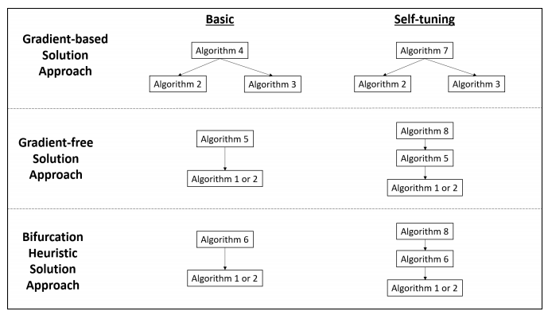

# Markov Decision Process Poisoning
Algorithms for poisoning finite-horizon Markov Decision Processes at design time.

### Background
The contemporary decision making environment is becoming
increasingly more automated. Developments in artificial intelligence,
machine learning, and operations research have increased the prevalence
of computer systems in decision making tasks across a myriad of
applications. Markov decision processes (MDPs) are utilized in a variety
of system controllers, and attacks against them are of particular
interest, even though this problem structure is relatively understudied
in the adversarial learning literature. Therefore, in this research, we
consider the finite-horizon MDP poisoning problem wherein an adversary
perturbs a decision maker's baseline MDP formulation to induce desired
behavior while balancing the risk of attack detection. We formally define
the associated mathematical programming formulation as a mixed-integer
bilevel programming problem. We provide a single-level representation
that can be handled by some commercial global solvers, but, since their
performance is frequently inadequate, we develop gradient-based,
gradient-free, and bifurcation heuristic solution methodologies that
include self-tuning extensions. The performance of these algorithms is
explored on a wide array of sample problem instances to determine their
relative efficacy in terms of solution quality and computational effort
for different finite-horizon MDP structures.

### Approach

1. LimitedBI.m
2. LimitedBISmooth.m
3. Reverse Mode Automatic Differentiation
4. PoisonFiniteMDP_GradientDescent.m
5. PoisonFiniteMDP_GradientFree.m
6. PoisonFiniteMDP_Bifurcation.m
7. PoisonFiniteMDP_GradientDescent_autotune.m
8. PoisonFiniteMDP_GradientFree_autotune.m
9. PoisonFiniteMDP_Bifurcation_autotune.m

### Getting Started
Each algorithm is saved in a separate Matlab file in the `src` directory. The results are collected in a zip file in the `results` directory. Download a zip of the project or clone it to your local machine to open the files in Matlab and run the algorithms.
